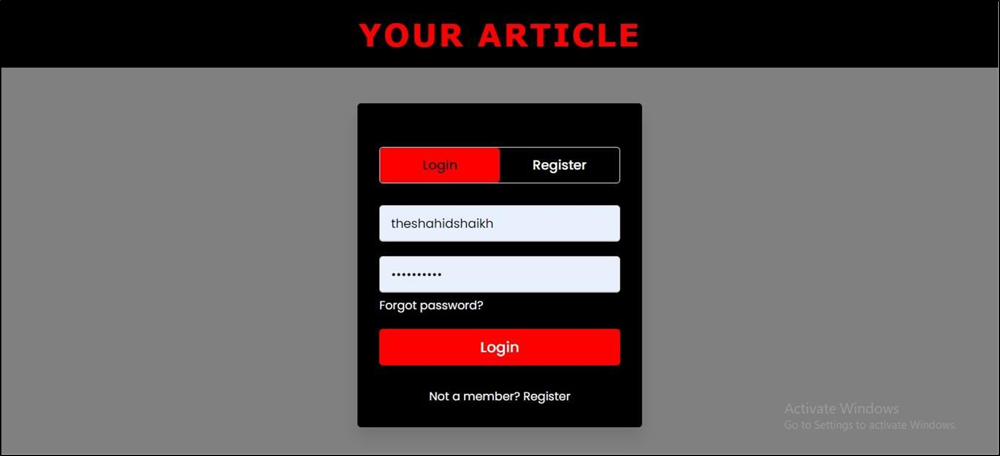
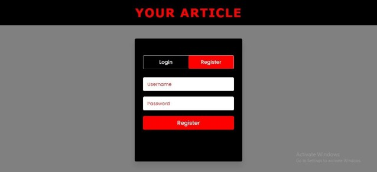
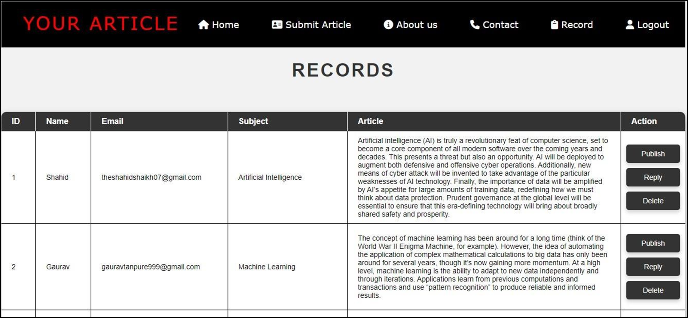
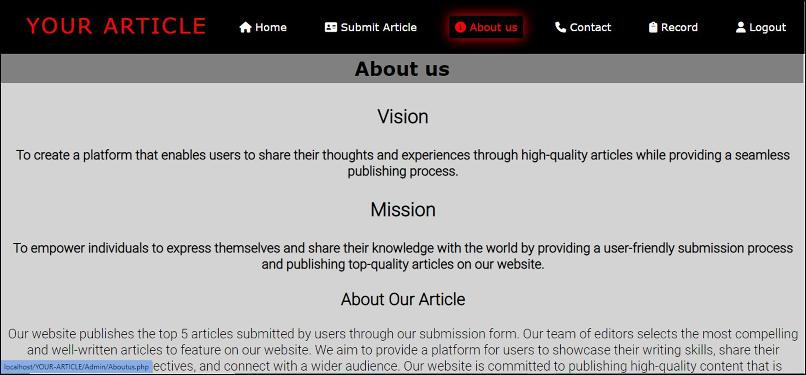
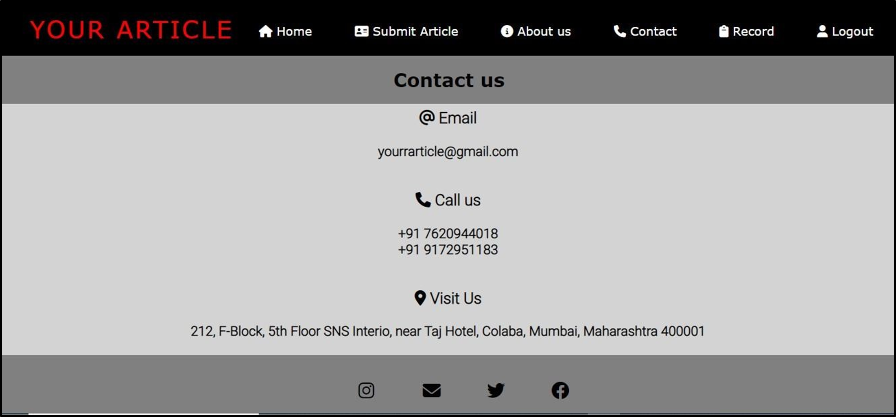

# 📝 Your Article

**Your Article** is a web application that empowers users to share their ideas by submitting articles through a straightforward form. Administrators receive notifications via Gmail, enabling them to review and publish the top five submissions. This process ensures high-quality content and encourages users to contribute their best work, fostering a vibrant community of writers.

---

## 🚀 Features

- **User-Friendly Submission Form**: Allows users to easily submit their articles.
- **Admin Dashboard**: Enables administrators to review, select, and publish articles.
- **Gmail Notifications**: Notifies administrators of new submissions.

---

## 🛠️ Technologies Used

- **Frontend**: HTML, CSS, JavaScript
- **Backend**: PHP
- **Database**: MySQL
- **Email Service**: PHPMailer for Gmail notifications

---


## 🧪 How to Use

1. **Install XAMPP or WAMP**

   - Download and install [XAMPP](https://www.apachefriends.org/index.html) or [WAMP](http://www.wampserver.com/en/) on your machine to set up a local web server with PHP and MySQL.

2. **Clone the Repository into the htdocs folder of XAMPP or WAMP**

   ```bash
   git clone https://github.com/theshahidshaikh07/YOUR-ARTICLE.git

3. **Start Apache and MySQL in XAMPP OR WAMP**
    -  Open the XAMPP/WAMP control panel and start the Apache and MySQL services.

4. **Create Database and Import SQL**

    -  Open your browser and navigate to http://localhost/phpmyadmin
    -  Create a new database named "yourarticle".
    -  Import the SQL file provided (SQL/yourarticle.sql) into this database.
    -  You can find Admin ID and password in Imported Table

5. **Configure Email Settings**
    -  In the PHP mail script, update the Gmail SMTP settings with your Gmail credentials to enable admin notification emails.

6.  **Run the Application**
    -  Open your browser and go to:
        http://localhost/YOUR-ARTICLE/index.php

## Preview








## Help
If you need any type of help you can mail me on theshahidshaikh7@gmail.com

